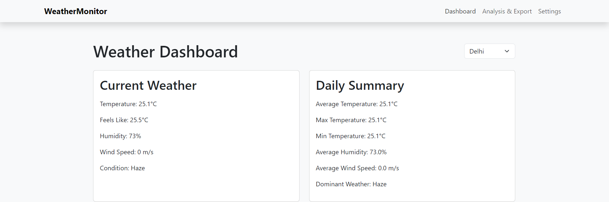
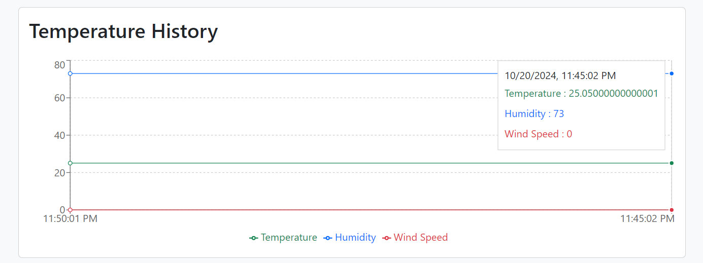
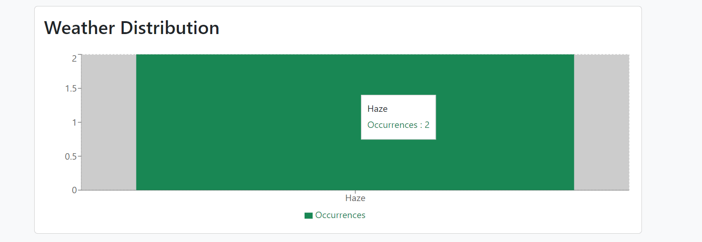
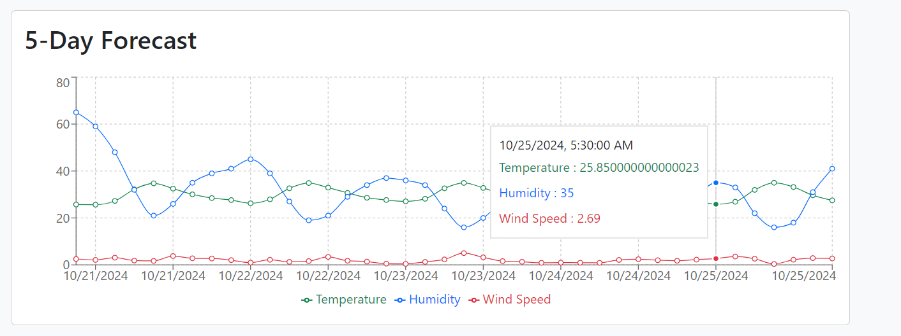
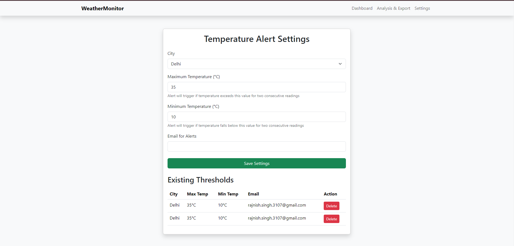
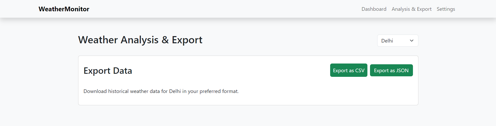

# Weather Monitoring System

## Overview:

Develop a real-time data processing system to monitor weather conditions and provide
summarized insights using rollups and aggregates. The system will utilize data from the
OpenWeatherMap API (https://openweathermap.org/)

## Workflow instances:













## Rollups and Aggregates implemented:

## 1. Daily Weather Summary

The system performs roll-ups on weather data for each day and calculates the following aggregates:

- **Average Temperature:**  
  The mean temperature across all recorded data points of the day.

- **Maximum Temperature:**  
  The highest temperature recorded on that day.

- **Minimum Temperature:**  
  The lowest temperature recorded on that day.

- **Dominant Weather Condition:**  
  The most frequently observed weather condition (e.g., Rain, Clear, Cloudy) becomes the dominant condition.
  - **Reasoning:** Dominance is determined by the weather condition with the highest occurrence count in the day’s data.

The **daily summaries** are stored in a **database** or persistent storage for further analysis.

---

## 2. Alerting Thresholds

The system allows defining **user-configurable thresholds** for alerts based on temperature or weather conditions.

- **Temperature Thresholds:**  
  Example: Alert if the temperature exceeds **35°C** for **two consecutive updates**.

- **Weather Condition Thresholds:**  
  Example: Alert if extreme weather conditions like "Storm" occur.

### How It Works:

1. User sets the thresholds via configuration.
2. The system continuously monitors live weather data.
3. If a threshold is breached, an alert is triggered.

### Alerting Mechanism:

- **Console Alerts:** Display alerts directly in the console.
- **Email Notifications:** The system can send alerts via email (email implementation is open-ended for future enhancements).

---

## 3. Visualizations

The weather dashboard provides interactive visualizations for better insights into weather trends.

- **Daily Weather Summaries:**  
  Display a summary of temperature and weather conditions for each day.

- **Historical Trends:**  
  Use line charts to show temperature variations over time.

- **Triggered Alerts:**  
  Highlight important weather events and breaches of thresholds in the visualizations.

## Tests:

1. Types of tests <br/>
   `api test`<br/>
   `email test` <br/>
   `forecast test` <br/>
   `weather test` <br/>

2. Steps to run tests:

```bash
cd server
go to directory server/test
npm test
```

## Setup Instructions:

1. Clone the repository

```bash
git clone https://github.com/rks-031/weather-monitoring.git
```

2. Install Dependencies

```bash
npm install
```

3. Configure environment variables:

```bash
OPENWEATHER_API_KEY=your_api_key
MONGODB_URI=mongodb://localhost:27017/weather
EMAIL_USER=your_email
EMAIL_PASS=your_email_app_password
```

4. Run the client and server separately

```bash
cd client
npm run dev
```

```bash
npm run dev
```

## Weather Endpoints:

- GET `/api/weather/:city`

  - Returns current weather data
  - Parameters: city (string)

- GET `/api/weather/:city/history`

  - Returns historical weather data
  - Parameters: city (string)

- GET `/api/summary/:city`
  - Returns daily weather summaries
  - Parameters: city (string)

## Threshold Endpoints

- POST `/api/thresholds`

  - Creates new temperature threshold
  - Body: { city, maxTemp, minTemp, email }

- GET `/api/thresholds`

  - Returns all thresholds

- DELETE `/api/thresholds/:id`
  - Deletes a threshold
  - Parameters: id (string)

## Data Export

Access historical data exports at:

- `/api/export/csv` - CSV format
- `/api/export/json` - JSON format
